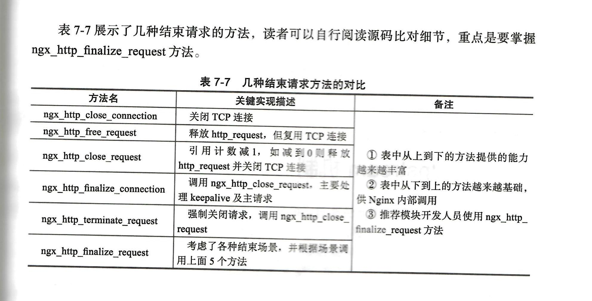

# How nginx give response to client
## 1.Filter module: operate data which will be put in response
Nginx filter data in response header and response body. Data wants to response to client must deliver by those two functions:
```c
ngx_http_top_header_filter(r);
ngx_http_top_body_filter(r,in);
```
### 1.1 Difference bewteen filter module and http module
- filter modules just modify response data, but http module also operates http request  
- filter modules don't work at the eleven module, it just works after http module return the response header and body  
- the order of module executing are quite different. Http module use array in `phase_engine` and index to choose the corresponding callback function. However filter modules use linked list to store them.  

### 1.2 Order of filter modules when register
As we know nginx uses linked list to store filter module. How is is initialized?  
It is initialized from the last one to the top one. So **the ealier module is registered, the later it is visited**.
@todo: review this algorithm.  

## 2.Send response
There are two important modules when it comes to sending response back.  
- `ngx_http_header_filter` in ngx_http_header_filter_module  
- `ngx_http_write_filter_module` in ngx_http_write_filter_module  

### 2.1 What happenes if the response data cannot be sent at once?
When the response data is too large, nginx cannot send it back to client at once. As a result we must own a mechanlism to solve this trouble.  
As a full asynchronized framework, storing data in event object and set the flag to wait another turn to continue is a normal strategy. Actually nginx quite uses this strategy.  
Nginx stores the left data in `header_out` which is a member of `ngx_http_request_t`.  

## 2.2 How nginx sends response?
Nginx calls function `ngx_http_write_filter` to send both response header and response body. Let's take an eye on it.
- Function declaretion  
```c
ngx_int_t ngx_http_write_filter(ngx_http_request_t *r, ngx_chain_t *in);
```

- Check out data which is wait to send  
- Append data wants to be sent this turn to the out buffer
- Check whether it's time to send data in buffer
- Check flags in buffer to determin what to do next
- Calculate chunk size sent this turn according to rate limiting configuration
- Send packet to client
- Recalculate the rate of sending stream and generate new rate limiting amount
- reset out buffer to remove data which has already sent  

## 3.Finalize http request
When close a http request, we must take care of the following things:  
- Closing http request doesn't means closing tcp connection for tcp connection reusing.  
- Judge reference count before closing for keep-alive connection and sub-request.  
- Large header or body is not finished so closing http request will also finish by event module.  

It uses function `ngx_http_finalize_request` to do this.  
  

**In this stage this is the stage inside nginx, it is nothing for client**.  
### 3.1 When to close tcp connection?  
In function `ngx_http_finalize_request` it calls `ngx_http_finalize_connection`.  
It check `count`, `discard_body`, `keep_alive` and `lingering_close` flag to judge whether nginx should close tcp connection. 

